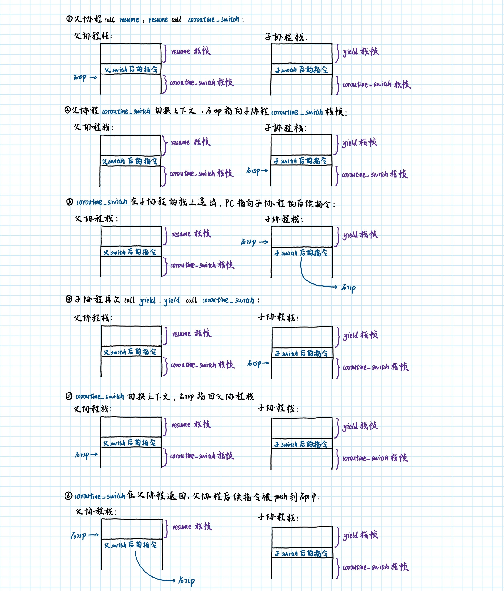
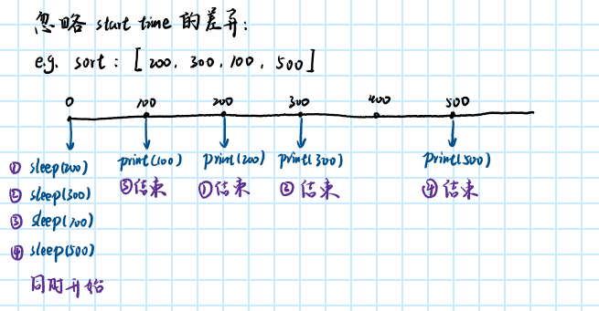

# 计算机系统概论 2022 秋 协程实验

## Task 1: 协程库的编写

### 协程切换时栈的变化过程

正常通过 `resume` 和 `yield` 切换协程的方法如下图所示：



另外还有两种特殊情况：

- 首次调用 `resume` 时，并不通过在子协程的栈上 ret 来改变 PC 的指向，而是直接 jmpq 到预先设定好的 `coroutine_entry`，`coroutine_entry` call `coroutine_main`，`coroutine_main` 开始执行子协程。
- 最后一次进入子协程，不从 `yield` 返回（因为没有 `yield`），`coroutine_main` 会直接调用 `coroutine_switch`，然后切换回父协程。


### 解释协程如何开始执行

**进入子协程：**

父协程栈顶为 `resume` 的栈帧。子协程栈空，预设了：①对齐的栈顶位置（RSP）；②第一条指令位置（RIP）；③第一个函数位置及参数（R12和R13）。

栈顶的对齐：源代码中 `stack` 指向堆内存的首地址（最低），`&stack[stack_size - 1]` 则是最高地址。

由于栈是由高向低扩张，故将高地址作为栈底；而为了 16 bytes 对齐，需将最高地址的前 4 bit 置为 0，得到对齐的地址中最高的一个。

```cpp
uint64_t rsp = (uint64_t)&stack[stack_size - 1]; // 最高地址
rsp = rsp - (rsp & 0xF); // 对齐的最高地址
```

父协程 call `coroutine_switch` 后保存当前状态。然后切换上下文到子协程，通过 mov 使 `%rsp` 指向新栈，通过 jmp 使 `%rip` 指向 `coroutine_entry`， 开始执行。

`coroutine_entry` 的作用就是进入 `coroutine_main`。`coroutine_main` 相当于子协程的 main 函数，做了三件事：run 预设的代码；标记 finish；通过切换上下文返回父协程。

```cpp
void coroutine_main(struct basic_context *context){
  context->run(); // run 预设的代码
  context->finished = true; // 标记 finish
  coroutine_switch(context->callee_registers, context->caller_registers); // 通过切换上下文返回父协程

  // unreachable
  assert(false);
}
```

**子协程 yield：**

如上图所示，`coroutine_switch` 被父/子协程调用，在子/父协程退出。通过 mov 直接改变 `%rsp` 指向；通过 ret 间接改变 PC 指向。

`coroutine_switch` 的实现如下：

```assembly
.global coroutine_switch
coroutine_switch:
    # TODO: Task 1
    # 保存 callee-saved 寄存器到 %rdi 指向的上下文
    movq %rsp, 64(%rdi)
    movq %rbx, 72(%rdi)
    movq %rbp, 80(%rdi)
    movq %r12, 88(%rdi)
    movq %r13, 96(%rdi)
    movq %r14, 104(%rdi)
    movq %r15, 112(%rdi)
    # 保存的上下文中 rip 指向 ret 指令的地址（.coroutine_ret）
    leaq .coroutine_ret(%rip), %rax
    movq %rax, 120(%rdi)

    # 从 %rsi 指向的上下文恢复 callee-saved 寄存器
    movq 64(%rsi), %rsp
    movq 72(%rsi), %rbx
    movq 80(%rsi), %rbp
    movq 88(%rsi), %r12
    movq 96(%rsi), %r13
    movq 104(%rsi), %r14
    movq 112(%rsi), %r15
    # 最后 jmpq 到上下文保存的 rip
    jmpq *120(%rsi)

.coroutine_ret:
    ret
```

**子协程 finish：**

`coroutine_main` 通过 `coroutine_switch` 执行返回操作，ret 到父协程。

### 处理浮点和向量寄存器

扩展 `basic_context` 中的 `caller_registers` 和 `callee_registers`，使他们可以保存更多寄存器；或者，再多加几个数组成员保存不同种类寄存器。

在 `coroutine_switch` 的汇编中，每次都额外 set 和 get 新加入的 callee-saved 寄存器，保证所有需要的上下文信息能够保存和切换。

## Task 2: 实现 sleep 函数

### 完成 `sleep` 函数

需要完成的只有非并发执行时的 `sleep` 操作：

```cpp
// 从 g_pool 中获取当前协程状态
auto context = g_pool->coroutines[g_pool->context_id];

// 获取当前时间，更新 ready_func
// ready_func：检查当前时间，如果已经超时，则返回 true
auto cur = get_time();
context->ready = false;
context->ready_func = [cur, ms](){
  if (std::chrono::duration_cast<std::chrono::milliseconds>(get_time() - cur).count() < ms)
    return false; // 时间已经超过预定等待时间，可以继续执行
  return true;    // 时间未超过预定等待时间，继续等待
};

// 调用 coroutine_switch 切换到 coroutine_pool 上下文
coroutine_switch(context->callee_registers, context->caller_registers);
```

调用 `sleep` 会先将 `ready` 置为 false，注册 `ready_func` 并开始计时。`ready_func` 的实现就是返回 duration 是否大于 ms。

### 完成 `serial_execute_all` 函数

```cpp
void serial_execute_all(){
  is_parallel = false;
  g_pool = this;

  // 有协程时轮换执行
  if (coroutines.size()){
    context_id = 0; // id 指向第一个协程
    // 按 id 循环，直到全部 finish
    for (int finished_cnt = 0; finished_cnt < coroutines.size(); context_id == coroutines.size() - 1 ? context_id = 0 : ++context_id){
      auto context = coroutines[context_id];
      if (context->finished) // 跳过已完成的协程
        continue;
      if (context->ready || (context->ready = context->ready_func())){ // 没有 ready，检查是否 ready
        context->resume();     // 继续执行
        if (context->finished) // 完成后计数加一
          ++finished_cnt;
      }
    }
  }

  for (auto context : coroutines){
    delete context;
  }
  coroutines.clear();
}
```

新加入的就是一个 `context->ready || (context->ready = context->ready_func())` 的判断，如果 `context->ready` 为 false，就通过 `context->ready_func()` 检查时间，`sleep` 时间足够长仍可以在当前循环中继续执行。

### 额外要求

1. 按照时间线，绘制出 `sleep_sort` 中不同协程的运行情况



2. 目前的协程库实现方式是轮询 `ready_func` 是否等于 `true`，设计一下，能否有更加高效的方法

将 `basic_context::ready` 和 `basic_context::ready_func` 和并为一个 `std::chrono::_V2::system_clock::time_point` 成员 `ready_time`。

`ready_time` 初始化为构造的时间，也就是说，之后正常地调用 `execute_all`，协程总是 ready 的，因为当前时间大于 `ready_time`。

在需要 `sleep` 时，将 `ready_time` 重新设置为 `std::chrono::system_clock::now() + ms`，即当前时间后 ms 毫秒。这样再调用 `execute_all` 时，若当前时间小于 `ready_time`，就知道要先跳过循环。

如此，`sleep` 函数便只需如下操作：

```cpp
// 从 g_pool 中获取当前协程状态
auto context = g_pool->coroutines[g_pool->context_id];

// 更新ready_time
context->ready_time = get_time() + ms;

// 调用 coroutine_switch 切换到 coroutine_pool 上下文
coroutine_switch(context->callee_registers, context->caller_registers);
```
`execute_all` 中的判断也可以简化：

```cpp
if (std::chrono::system_clock::now() >= context->ready_time){ // 没有 ready，检查是否 ready
  context->resume();     // 继续执行
  if (context->finished) // 完成后计数加一
    ++finished_cnt;
}
```

## Task 3: 利用协程优化二分查找

### 完成 `lookup_coroutine`

```cpp
// TODO: Task 3
// 使用 __builtin_prefetch 预取容易产生缓存缺失的内存
__builtin_prefetch(&table[probe], 0, 1);
// 并调用 yield
yield();
```

当前协程预先将待查询位置 `&table[probe]` 缓存到 L2 中（经过测试，这道题缓存到 L2 中比缓存到 L1 中更快）。然后yield，在 IO 时将 CPU 资源用于其他协程。

### 性能的提升效果

进行 4 次测试，结果如下：

```
Size: 4294967296
Loops: 1000000
Batch size: 16
Initialization done
naive: 1393.72 ns per search, 43.55 ns per access
coroutine batched: 1120.58 ns per search, 35.02 ns per access
```

```
Size: 4294967296
Loops: 1000000
Batch size: 16
Initialization done
naive: 1267.24 ns per search, 39.60 ns per access
coroutine batched: 1192.41 ns per search, 37.26 ns per access
```

```
Size: 4294967296
Loops: 1000000
Batch size: 16
Initialization done
naive: 1537.88 ns per search, 48.06 ns per access
coroutine batched: 1228.64 ns per search, 38.40 ns per access
```

```
Size: 4294967296
Loops: 1000000
Batch size: 16
Initialization done
naive: 1673.23 ns per search, 52.29 ns per access
coroutine batched: 1346.17 ns per search, 42.07 ns per access
```

可以看到一定的性能提升。


## 参考资料

了解协程相关知识：

https://www.bilibili.com/video/BV1y3411u7Me/?spm_id_from=333.337.search-card.all.click&vd_source=782e227349ebd772d84713ec752b8f92

[cs-notes/计算机基础 at main · tomstillcoding/cs-notes (github.com)](https://github.com/tomstillcoding/cs-notes/tree/main/计算机基础)


## 总结和感想

协程的实现需要一些并发编程的思想，对于刚刚入门的我来说的确有些理解上的困难。

这个实验很多内容都靠自学，的确收获很大。不过，我觉得如果课堂上能先讲一些进程和线程的基本知识，理解和使用协程可能会容易一些。

